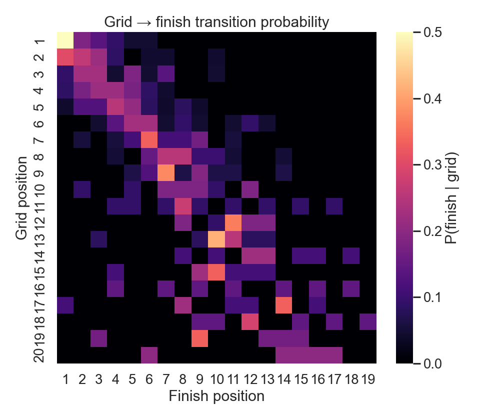
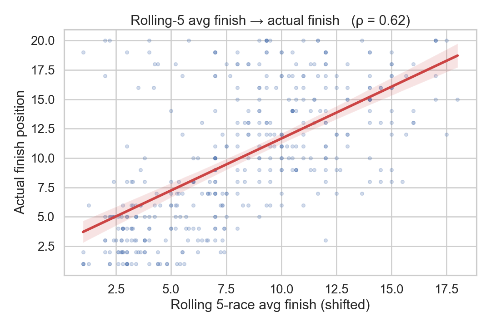
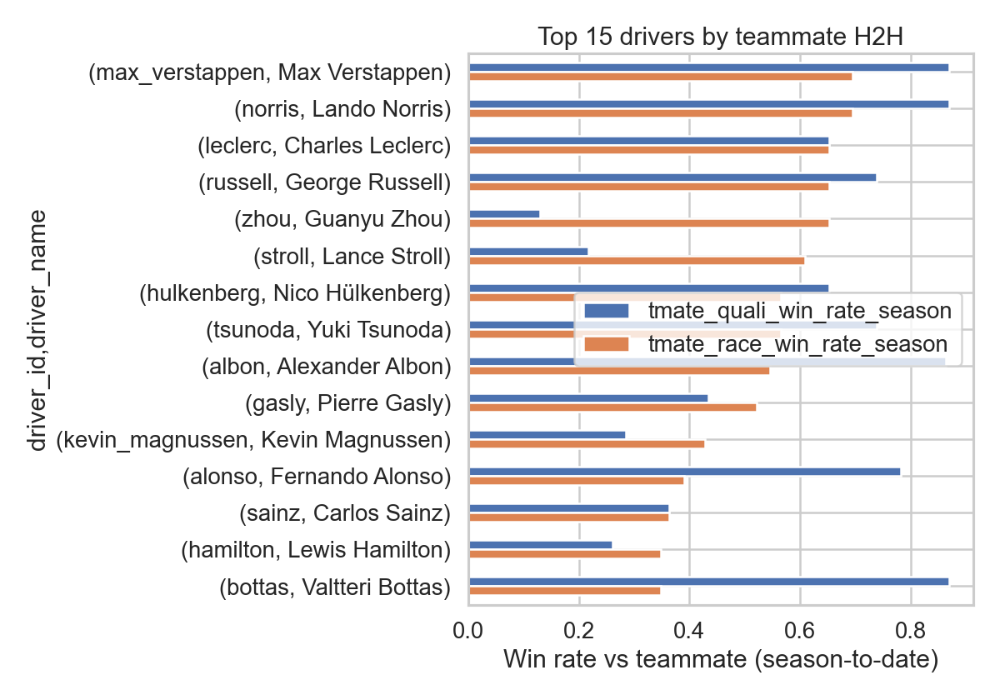
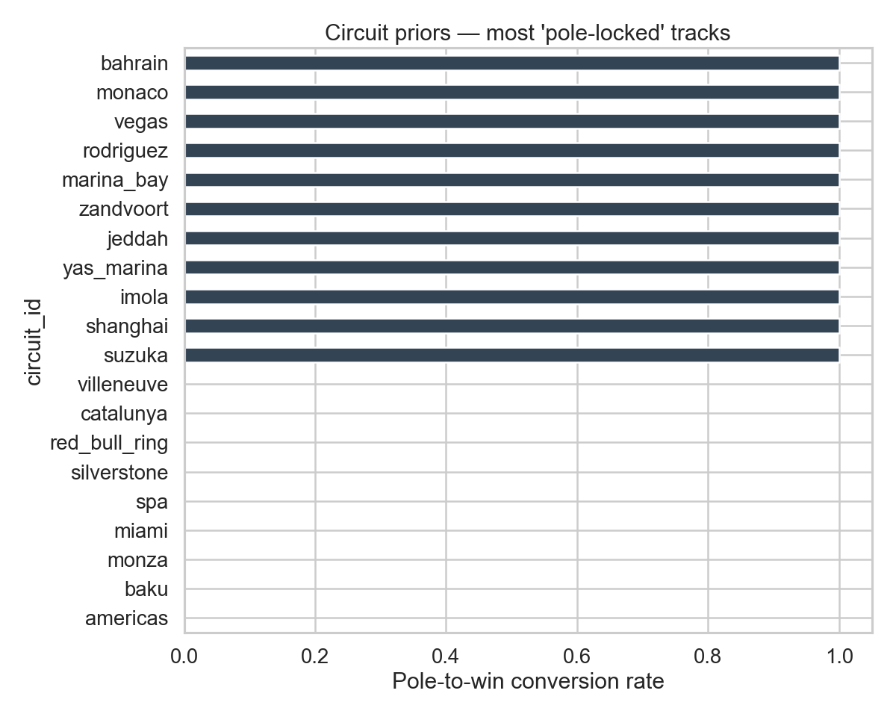
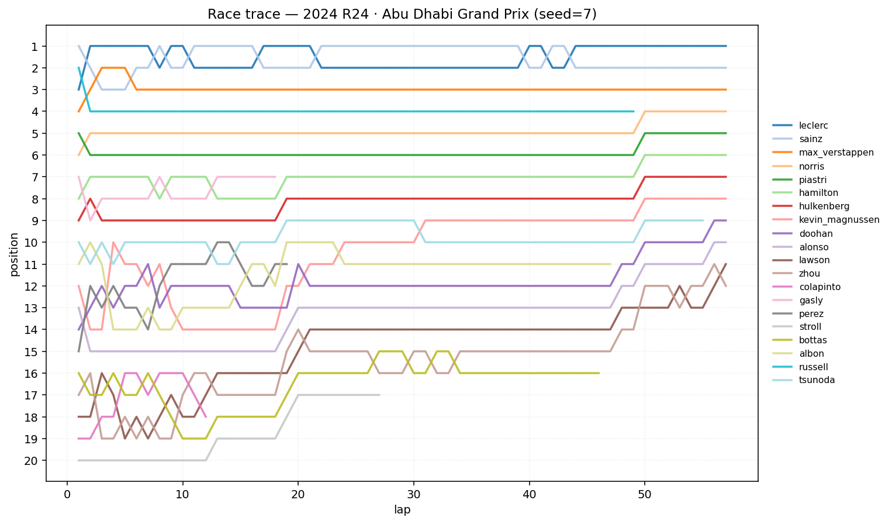

# 🏎️ F1 Analytics AI

An end-to-end Formula 1 analytics and simulation platform that predicts race outcomes, simulates full races lap-by-lap, and compares drivers head-to-head — backed by real F1 data (FastF1 + Ergast), machine learning (LSTM + RL + Monte Carlo), and a retrieval-augmented prompt layer.

> **Status:** ✅ Complete — all 8 stages shipped. Race replay animation + race trace + docs polish landed in Stage 8.

---

## ✨ What it does

| Mode | Input | Output |
|---|---|---|
| 🔮 **Race Prediction** | Circuit + drivers + weather | Winner / pole probabilities, SC/VSC likelihood |
| 🎮 **Race Simulation** | Circuit + grid + weather | Lap-by-lap standings, tyre strategies, pit timing, incidents |
| ⚔️ **Head-to-Head** | Two drivers | Quali / race / consistency / circuit-specific edge |

---

## 🏗️ Architecture

```
┌──────────────┐     ┌───────────────┐     ┌──────────────────┐
│ FastF1 API   │     │ Ergast API    │     │ Weather (real    │
│ (telemetry)  │     │ (results      │     │  or FastF1 hist) │
│              │     │  since 1950)  │     │                  │
└──────┬───────┘     └───────┬───────┘     └────────┬─────────┘
       │                     │                      │
       └─────────────────────┼──────────────────────┘
                             ▼
                  ┌──────────────────────┐
                  │ Ingestion + Parquet  │  data/raw → data/processed
                  │ cache (scripts/)     │
                  └──────────┬───────────┘
                             ▼
                  ┌──────────────────────┐
                  │ Feature engineering  │  notebooks/ + backend/features
                  └──────────┬───────────┘
                             ▼
      ┌──────────────────────┼──────────────────────┐
      ▼                      ▼                      ▼
┌───────────┐         ┌──────────────┐       ┌──────────────┐
│ LSTM      │         │ Monte Carlo  │       │ RL agent     │
│ predictor │         │ simulator    │       │ (pit strat)  │
└─────┬─────┘         └──────┬───────┘       └──────┬───────┘
      └──────────────────────┼──────────────────────┘
                             ▼
                  ┌──────────────────────┐
                  │ FastAPI backend      │  /predict  /simulate  /h2h
                  │  + RAG (Chroma)      │
                  └──────────┬───────────┘
                             ▼
                  ┌──────────────────────┐
                  │ Streamlit frontend   │  4 screens (Dashboard /
                  │                      │  Sim / H2H / Prediction)
                  └──────────────────────┘
```

---

## 🧰 Tech stack

- **Data:** FastF1, Ergast API, (optional) OpenWeatherMap
- **ML:** PyTorch (LSTM), scikit-learn, XGBoost, custom RL agent, Monte Carlo
- **RAG:** ChromaDB + sentence-transformers
- **Backend:** FastAPI + Uvicorn
- **Frontend:** Streamlit + Plotly
- **Hardware target:** Apple M5, 16 GB unified memory

---

## 🚀 Quick start

```bash
# 1. Clone + enter
git clone https://github.com/saisarantottempudi/f1-analytics-ai.git
cd f1-analytics-ai

# 2. Create venv + install
python3 -m venv .venv
source .venv/bin/activate
pip install -r requirements.txt

# 3. Ingest data
python scripts/ingest_ergast.py --from 2000 --to 2025      # ~1.5 min, 500 races
python scripts/ingest_fastf1.py --from 2022 --to 2025      # ~20–30 min, downloads cache
python scripts/verify_data.py                              # prints row counts

# 4. Build engineered features (Stage 3)
python scripts/build_features.py                           # → data/processed/features.parquet
python notebooks/01_eda.py                                 # regenerates charts in notebooks/figures/

# 5. Train the ML layer (Stage 4)
python scripts/train_predictor.py --epochs 60              # LSTM → models/lstm_predictor.pt
python scripts/run_simulation.py --sims 1000               # Monte Carlo demo
python scripts/train_rl_pit.py --episodes 1500             # RL pit-strategy → models/rl_pit_q.json

# 6. Launch the API (Stage 5)
uvicorn backend.main:app --reload                          # → http://127.0.0.1:8000/docs
python scripts/smoke_api.py                                # in-process end-to-end test

# 7. Build the RAG index (Stage 6)
python scripts/build_rag_index.py                          # → rag/corpus/races.jsonl + rag/chroma_db/
# Then any endpoint supports ?explain=true (template) or ?explain=true&llm=true
# (Claude-Haiku refinement, requires ANTHROPIC_API_KEY or CLAUDE_API_KEY in .env)

# 8. Launch the 4-screen UI (Stage 7) — keep uvicorn running in another terminal
streamlit run frontend/streamlit_app.py                    # → http://localhost:8501
```

---

## 📁 Project layout

```
f1_project/
├── backend/         # FastAPI app, feature engineering, model wrappers
├── frontend/        # Streamlit app + pages
├── data/
│   ├── raw/         # Parquet dumps from FastF1 / Ergast (gitignored)
│   └── processed/   # Engineered features (gitignored)
├── models/          # Trained model weights (gitignored)
├── notebooks/       # EDA + training notebooks
├── rag/             # Chroma index + prompt templates
├── scripts/         # Ingestion + training CLIs
└── tests/
```

---

## 📈 Project status — 8-stage roadmap

Each stage ends with a git commit + push. The README is refreshed at each stage.

- [x] **1. Scaffold + Git init** — repo skeleton, README, `.gitignore`, deps pinned
- [x] **2. Data layer** — Ergast/Jolpica + FastF1 ingestion → Parquet cache; weather client
- [x] **3. Feature engineering + EDA** — 15 features across 6 families; EDA notebook with 5 charts
- [x] **4. ML core** — LSTM (PyTorch + MPS), Monte Carlo simulator, tabular-Q RL pit agent
- [x] **5. FastAPI backend** — `/predict`, `/simulate`, `/h2h` + OpenAPI docs
- [x] **6. RAG layer** — Chroma (MiniLM) over race narratives + Claude-Haiku explainer (BYO key)
- [x] **7. Streamlit frontend** — 4-screen UI (Home / Prediction / Simulation / H2H) hitting the FastAPI backend
- [x] **8. Replay animation + polish** — auto-playing lap replay, race-trace line chart, tyre-stint gantt, offline PNG renderer

---

## 📊 Stage 3 — features shipped

The feature table ([backend/features/build.py](backend/features/build.py), produced by [scripts/build_features.py](scripts/build_features.py)) holds one row per (driver × race) with **6 feature families, computed strictly causally** (race N never sees data from race ≥ N):

| Family | Columns |
|---|---|
| Driver rolling form | `drv_rollN_avg_finish_5`, `drv_rollN_dnf_rate_5`, `drv_rollN_points_avg_5` |
| Driver × circuit history | `drv_circ_races_prior`, `drv_circ_avg_finish_prior`, `drv_circ_best_prior` |
| Consistency | `drv_season_finish_std`, `drv_season_finish_iqr` |
| Constructor form | `team_rollN_avg_finish_3` |
| Teammate H2H | `tmate_quali_win_rate_season`, `tmate_race_win_rate_season` |
| Circuit priors | `circ_pole_to_win_rate`, `circ_dnf_rate`, `circ_grid_finish_corr` |

EDA charts — rendered from the 2024 slice, will stabilise once 2000-2025 ingest completes:

| | |
|---|---|
|  |  |
|  |  |

Form→finish Pearson ρ ≈ **0.62** on the 2024 slice — the rolling feature alone carries substantial signal before any ML.

---

## 🧠 ML core (stage 4 — shipped)

| Component | Lives in | What it does |
|---|---|---|
| **LSTM predictor** | [backend/ml/predictor.py](backend/ml/predictor.py) | Stacked LSTM + categorical embeddings (driver / team / circuit) over a 5-race window. MC-dropout at inference yields a per-driver finish-position distribution. Trains on MPS in seconds. |
| **Monte Carlo simulator** | [backend/ml/monte_carlo.py](backend/ml/monte_carlo.py) | Lap-by-lap race sim with compound-specific tyre deg, fuel burn, pit loss, SC/VSC triggers, and DNF sampling. 1 000 sims in ~5 s. |
| **Tabular Q pit agent** | [backend/ml/rl_pit.py](backend/ml/rl_pit.py) | Q-learning over a discretised (phase, tyre-age, pace-rank, laps-left) state. Learns when to stay out vs. pit for Soft/Medium/Hard. |

Why tabular Q (not DQN): the state space fits in a dict and trains in seconds on a laptop. Upgrade path is DQN if the discretisation hurts us later.

Trained artifacts live in `models/` — `.pt` binaries are gitignored (re-train after clone), the small Q-table JSON ships in-repo so demos work out-of-the-box.

## 🌐 Stage 5 — API shipped

Three FastAPI endpoints wrap the ML layer. OpenAPI docs at `/docs`.

| Route | Body | Returns |
|---|---|---|
| `POST /predict` | circuit, total laps, grid, weather, `n_sims` | per-driver mean finish + P(win) / P(podium) / P(points), pole, predicted winner, SC probability |
| `POST /simulate` | circuit, grid, optional strategies, weather, seed | final standings, lap-by-lap timeline snapshots, event log (SC/VSC/DNF/PIT) |
| `POST /h2h` | driver_a, driver_b, optional season range + circuit | 8 comparison sections + overall-edge % |

End-to-end smoke test ([scripts/smoke_api.py](scripts/smoke_api.py)) hits all three via `TestClient`. Sample 2024-slice output:

```
/predict       ✅  winner=leclerc  SC=70%
                · max_verstappen  p_podium=99.0%
                · leclerc         p_podium=98.5%
/simulate      ✅  laps_ran=55  timeline_snapshots=55  events=27
/h2h           ✅  norris vs piastri  shared=24  winner=A  edge=50.0%
                · Head-to-head quali wins (shared races)   A=21  B=3 → A
```

## 📦 Stage 6 — RAG + narrative explanations (shipped)

**What it does.** Every API endpoint now accepts `?explain=true`. The server:

1. Generates a compact narrative per past race from results (24 for the 2024 slice → 500+ after full ingest) and embeds it into a persistent **Chroma** index using MiniLM (ONNX, no GPU, no API).
2. On each request, retrieves the top-5 most-similar past races (filtered by `circuit_id` when relevant) and stuffs them into a mode-specific prompt template.
3. **Always** returns a deterministic `narrative` built from the template — free, offline, fast.
4. When `?llm=true` AND `ANTHROPIC_API_KEY` (or `CLAUDE_API_KEY`) is set, upgrades the narrative with **Claude Haiku 4.5** — cheapest model, default `claude-haiku-4-5-20251001`, prompt-cached system prompt so repeated calls barely cost anything. Override with `F1_LLM_MODEL`.
5. If the LLM call fails for any reason, silently falls back to the template.

**Sample generated narrative (2024 Bahrain GP):**

> 2024 Bahrain Grand Prix at bahrain (2024-03-02). Max Verstappen (red_bull) won from grid P1. Podium: P1 Max Verstappen, P2 Sergio Pérez, P3 Carlos Sainz. Pole went to Max Verstappen. Biggest move was Guanyu Zhou gaining 6 positions (P17 → P11). Nico Hülkenberg lost 6 positions (P10 → P16).

**Sample retrieval test** — query "wet race rainy Spa Belgian GP" → top hit `2024-14-spa` (Hamilton win from P3).

**Files.** [corpus_builder.py](rag/corpus_builder.py) · [index.py](rag/index.py) · [prompts.py](rag/prompts.py) · [llm.py](rag/llm.py) · [explain.py](backend/api/explain.py)

The API `/health` endpoint now reports `rag_index_ready` and `llm_key_present` so the Streamlit frontend (stage 7) can grey out the relevant toggles.

## 🖥️ Stage 7 — Streamlit frontend (shipped)

Four screens, all talking to the local FastAPI backend (no new business logic — the UI is a thin shell over `/meta`, `/predict`, `/simulate`, `/h2h`). Narrative toggles grey themselves out when the LLM key isn't present.

| Screen | File | What it does |
|---|---|---|
| 🏎️ **Home Dashboard** | [streamlit_app.py](frontend/streamlit_app.py) | Race selector (populated from `/meta`), driver multi-select → starting grid, weather + sim settings. Writes selection to `st.session_state` for the other pages. |
| 🔮 **Prediction** | [1_🔮_Prediction.py](frontend/pages/1_🔮_Prediction.py) | Calls `/predict`, shows predicted winner + pole + SC%, grouped bar chart of P(win)/P(podium)/P(points), progress-bar table. |
| 🎮 **Race Simulation** | [2_🎮_Race_Simulation.py](frontend/pages/2_🎮_Race_Simulation.py) | Calls `/simulate`, renders a lap slider → leaderboard snapshot, tyre-compound scatter across all laps, filterable events panel. |
| ⚔️ **Head-to-Head** | [3_⚔️_Head_to_Head.py](frontend/pages/3_⚔️_Head_to_Head.py) | Calls `/h2h` with optional circuit / season filters, shows headline edge, breakdown table, and a radar of normalised sections. |

A shared [api_client.py](frontend/api_client.py) wraps `httpx` and caches `/health` + `/meta` for 30–60 s. Override the API base with `F1_API_BASE=...`.

**Run both services:**

```bash
uvicorn backend.main:app --reload         # :8000
streamlit run frontend/streamlit_app.py   # :8501
```

Smoke-verified both servers bind cleanly (`uvicorn` on `:8000`, `streamlit` on `:8501`) and that `scripts/smoke_api.py` still passes while the UI is running.

## 🎞️ Stage 8 — replay animation + polish (shipped)

The Simulation page now has four visualisations layered over the same `/simulate` response:

1. **Auto-playing replay** — Play / Pause / Reset + a 0.5×/1×/2×/4× speed selector. Under the hood it advances `st.session_state["replay_lap"]` one lap per `st.rerun()`, so dragging the slider mid-playback takes over cleanly.
2. **Position animation** — a Plotly scatter with a built-in play button, markers coloured by current tyre compound, hover shows tyre age + gap to leader.
3. **Race trace** — classic F1 position-over-laps line chart. Y-axis inverted so P1 is on top.
4. **Tyre-stint Gantt** — stacked horizontal bars per driver, one segment per stint, coloured by compound.

An offline renderer ([scripts/render_race_trace.py](scripts/render_race_trace.py)) dumps the same race trace to PNG without spinning up the UI — so the static picture below is generated from the exact same simulator the app uses:

```bash
python scripts/render_race_trace.py --seed 7
# → notebooks/figures/06_race_trace.png
```



*2024 Abu Dhabi GP, seed 7 — Sainz wins from Leclerc after a mid-race swap; two retirements visible as lines falling to the bottom.*

---

## 📜 License

TBD — add before public release.

---

*Built by [@saisarantottempudi](https://github.com/saisarantottempudi).*
